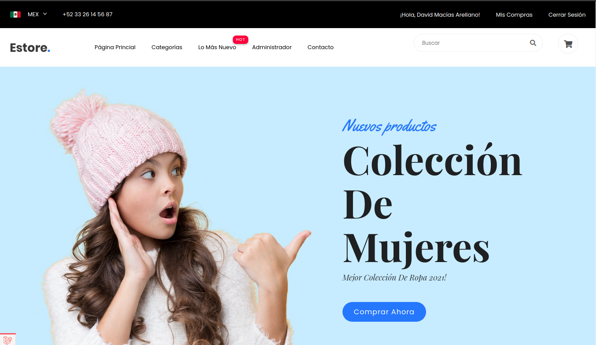
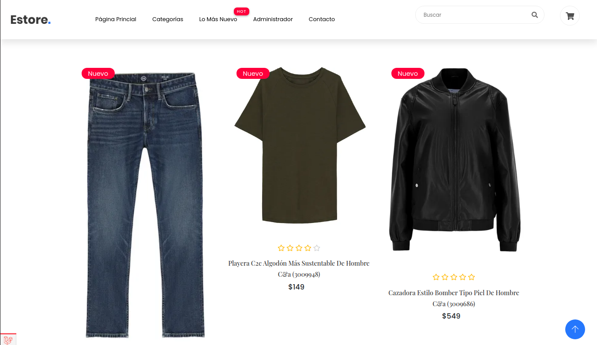
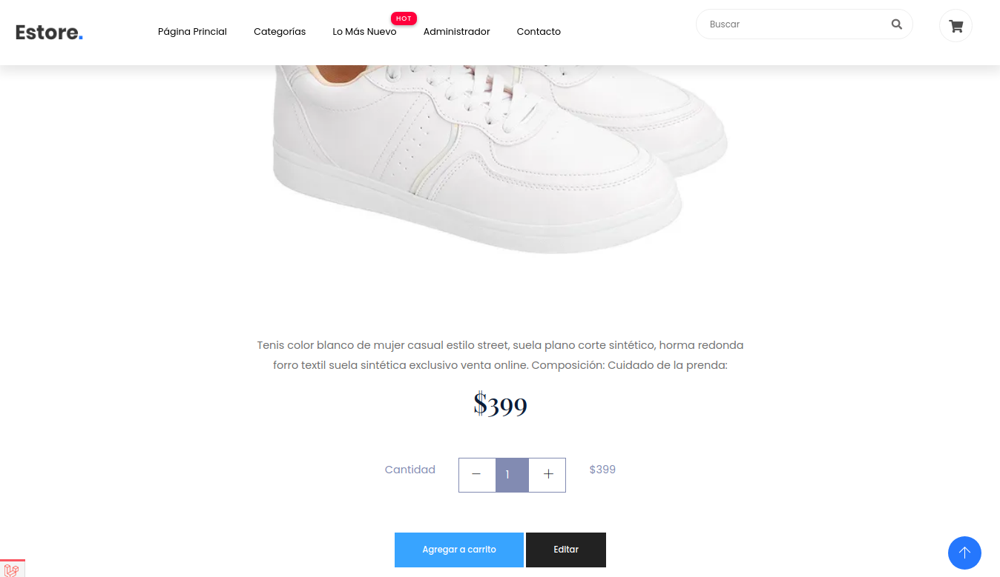
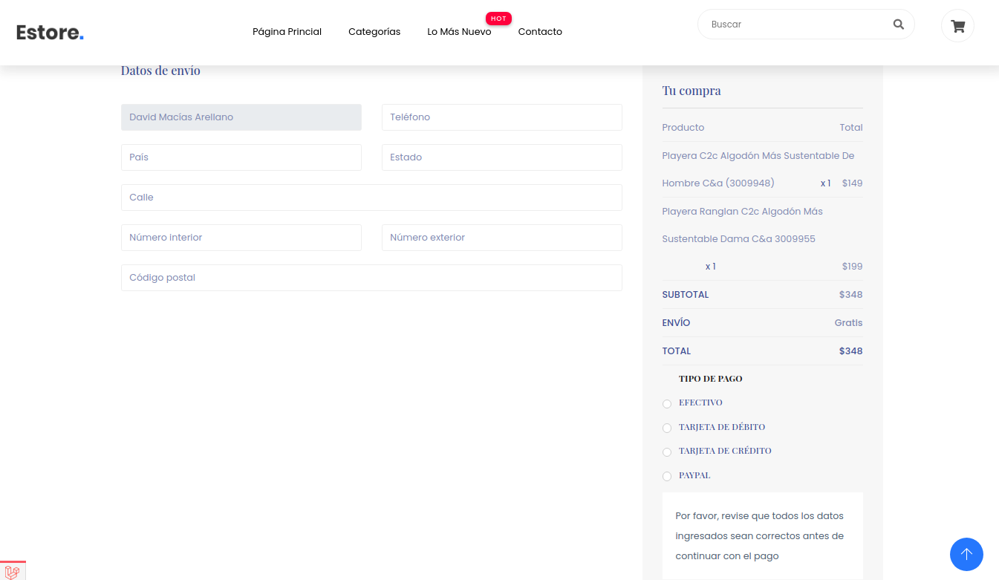

### Proyecto de tienda ropa online

**David Macías**

##### Descripción del proyecto
_Proyecto de una tienda de ropa en línea con las funciones básicas que este tipo de tiendas ofrecen. Las principales caracterísiticas son_

- Productos a comprar
- Categorías para los productos
- Carrito de compras con diferentes productos
- Carga de múltiples imágenes por producto

##### Página principal


##### Vista de productos


##### Añadir a carrito


##### Pagar carrito


##### Instrucciones de uso

Usar los siguientes seeders para cargar las categorías y tipos de pago

```
php artisan db:seed CategorySeeder
php artisan db:seed PaymentSeeder
```

##### Recomendación para testar
Cargar productos, imágenes y relación de seeder
```
php artisan db:seed ProductFileSeeder
```